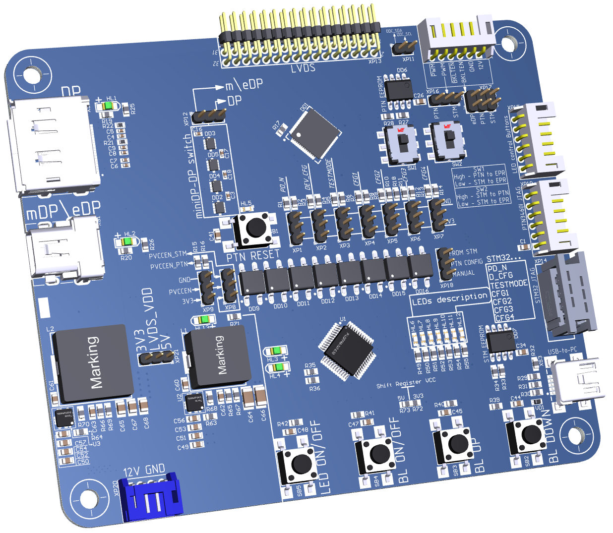
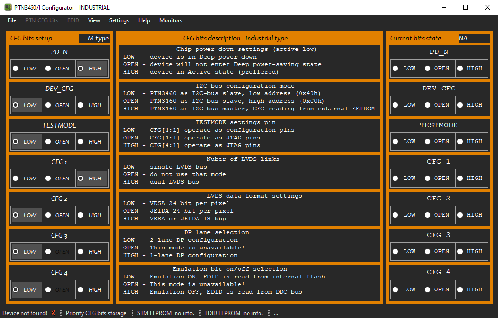
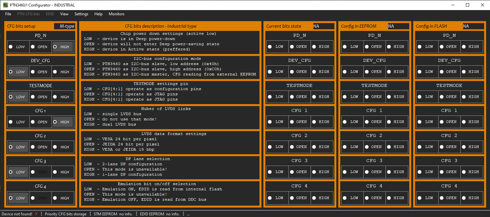

# PTN3460I-Configurator

### Readme in progress...

This software is part of a project developed 
for testing various LCD matrices for compatibility with the NXP [PTN3460/I] chip.

[PTN3460/I]: //https://www.nxp.com/products/peripherals-and-logic/signal-chain/bridges/ptn3460-ptn3460i-commercial-and-industrial-edp-to-lvds-bridge-ic:PTN3460/ "PTN 3460/I link"

Since there is a need to use the above chip from NXP with
using various matrices, I developed a printed circuit Board on my own to conduct the necessary tests.
A screenshot of the Board is shown below.

 View of designed PCB
 

The Board provides the following operating modes:
1. Manual configuration, by setting the jumpers to the "high" or "low" state;
2. Configuration of PTN3460/I without writing to EEPROM;
3. PTN3460/I configuration with EEPROM entry;
4. As an EEPROM programmer for products developed on the basis of PTN3460/I;
5. You can use it to control the illumination brightness of the matrix under test;
6. You Can use it to enable or disable the matrix.

### More details can be found in the video at the [link].

[link]: //https://youtu.be/_daPMuKV2iI/ "Demonstration video"

This Board has an STM32 controller installed (firmware for it via the link), which is used as
USB HID devices for exchanging information between the Host and the device,
and also as a software Configurator for the PTN3460/I chip.

The program interface is shown in the screenshots below.

